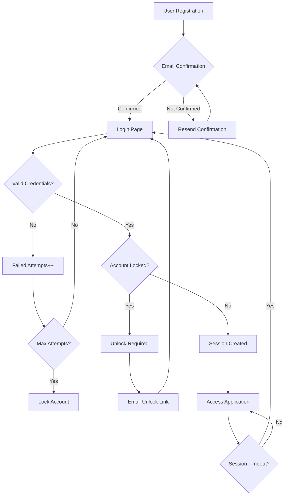

# Authentication & Authorization Guide

## Overview

Diquis uses a comprehensive authentication and authorization system built on Devise and Pundit, with modern UI components powered by Inertia.js and FlyonUI.

## Table of Contents

- [User Roles](#user-roles)
- [Authentication System](#authentication-system)
- [Authorization System](#authorization-system)
- [Security Features](#security-features)
- [Test Accounts](#test-accounts)
- [API Reference](#api-reference)

## User Roles

The system implements a hierarchical role-based access control (RBAC) system with 7 distinct roles:

### Role Hierarchy (Lowest to Highest)

1. **Player** (`player`) - Individual football players in the academy
   - View their own profile and statistics
   - View their guardian relationships
   - Update basic profile information

2. **Parent** (`parent`) - Parents/guardians of players
   - View profiles of their linked players
   - Manage player-guardian relationships
   - Accept/decline guardian invitations
   - View player statistics and progress

3. **Staff** (`staff`) - Support staff (fitness trainers, equipment managers, etc.)
   - View player rosters
   - Manage equipment and facilities
   - Limited administrative access

4. **Coach** (`coach`) - Football coaches and trainers
   - Manage teams and training sessions
   - View and update player statistics
   - Access to player development data
   - Create training schedules

5. **Academy Admin** (`academy_admin`) - Administrative staff
   - Manage users (except academy owners and super admins)
   - View all academy data
   - Manage day-to-day operations
   - Generate reports

6. **Academy Owner** (`academy_owner`) - Owner of the academy
   - Full access to academy operations
   - Manage all users including academy admins
   - Financial and business management
   - Cannot modify super admins

7. **Super Admin** (`super_admin`) - System administrator
   - Full system access
   - Manage all users including academy owners
   - System configuration and maintenance
   - Multi-academy management (future feature)

### Role Permissions Matrix

| Action | Player | Parent | Staff | Coach | Admin | Owner | Super |
|--------|--------|--------|-------|-------|-------|-------|-------|
| View own profile | ✅ | ✅ | ✅ | ✅ | ✅ | ✅ | ✅ |
| Update own profile | ✅ | ✅ | ✅ | ✅ | ✅ | ✅ | ✅ |
| View player list | ❌ | Limited | ✅ | ✅ | ✅ | ✅ | ✅ |
| Manage players | ❌ | Own children | ❌ | ✅ | ✅ | ✅ | ✅ |
| View statistics | Own | Own children | ✅ | ✅ | ✅ | ✅ | ✅ |
| Manage users | ❌ | ❌ | ❌ | ❌ | ✅ | ✅ | ✅ |
| System config | ❌ | ❌ | ❌ | ❌ | ❌ | ❌ | ✅ |

## Authentication System

### Devise Modules Enabled

- **Database Authenticatable**: Secure password authentication
- **Registerable**: User registration
- **Recoverable**: Password reset functionality
- **Rememberable**: "Remember me" cookies
- **Validatable**: Email and password validation
- **Confirmable**: Email confirmation before sign in
- **Lockable**: Account locking after failed attempts
- **Trackable**: Track sign-in count, timestamps, and IP addresses
- **Timeoutable**: Session expires after 2 hours of inactivity

### Available Routes

```ruby
# Session Management
POST   /users/sign_in          # Login
DELETE /users/sign_out         # Logout
GET    /users/sign_in          # Login page

# Registration
POST   /users                  # Register new user
GET    /users/sign_up          # Registration page

# Password Recovery
POST   /users/password         # Request password reset
PUT    /users/password         # Update password
GET    /users/password/new     # Password reset request page
GET    /users/password/edit    # Password reset page

# Email Confirmation
GET    /users/confirmation     # Show confirmation instructions
POST   /users/confirmation     # Resend confirmation email

# Account Unlocking
GET    /users/unlock           # Show unlock instructions
POST   /users/unlock           # Request unlock email
```

### Authentication Flow



## Authorization System

### Pundit Policies

Each model has a corresponding policy class that defines access rules:

#### UserPolicy

```ruby
# app/policies/user_policy.rb
class UserPolicy < ApplicationPolicy
  def index?
    user.can_manage_users?
  end

  def show?
    user == record || user.can_manage_users?
  end

  def update?
    user == record || user.can_manage_users?
  end

  def destroy?
    user.can_manage_users? && user != record
  end
end
```

#### PlayerGuardianPolicy

```ruby
# app/policies/player_guardian_policy.rb
class PlayerGuardianPolicy < ApplicationPolicy
  def create?
    user.role_parent? || user.can_manage_users?
  end

  def update?
    is_participant? || user.can_manage_users?
  end

  private

  def is_participant?
    record.player == user || record.guardian == user
  end
end
```

### Using Policies in Controllers

```ruby
class UsersController < ApplicationController
  def index
    authorize User  # Calls UserPolicy#index?
    @users = User.all
  end

  def show
    @user = User.find(params[:id])
    authorize @user  # Calls UserPolicy#show?
  end

  def update
    @user = User.find(params[:id])
    authorize @user  # Calls UserPolicy#update?
    
    if @user.update(user_params)
      # Success
    end
  end
end
```

### Using Policies in Views

```erb
<% if policy(User).index? %>
  <%= link_to "All Users", users_path %>
<% end %>

<% if policy(@user).update? %>
  <%= link_to "Edit", edit_user_path(@user) %>
<% end %>
```

## Security Features

### 1. Strong Password Requirements

All passwords must meet these criteria:

- **Minimum Length**: 12 characters
- **Uppercase Letter**: At least one (A-Z)
- **Lowercase Letter**: At least one (a-z)
- **Digit**: At least one (0-9)
- **Special Character**: At least one (!@#$%^&*...)
- **Not Common**: Password not in blacklist

**Example Valid Passwords**:

- `MyStr0ng!P@ssw0rd`
- `Footb@ll2025!`
- `Ac@demy#Secure99`

**Example Invalid Passwords**:

- `password123` ❌ Too short, no uppercase, no special char
- `PASSWORD123!` ❌ No lowercase
- `Password!` ❌ Too short, no digit
- `Password123` ❌ No special character
- `Password123!` ❌ Contains common word "password"

### 2. Session Management

- **Session Timeout**: 2 hours of inactivity
- **Remember Me**: Optional 2-week persistent session
- **Secure Cookies**: HttpOnly and Secure flags in production
- **Session Fixation Protection**: New session ID after login

### 3. Account Security

**Email Confirmation**:

- Users must confirm email before accessing the system
- Confirmation links expire after 3 days
- Resend confirmation available

**Account Lockout**:

- Locks after 5 failed login attempts
- Email sent with unlock instructions
- Time-based unlock after 1 hour
- Manual unlock via email link

**IP Tracking**:

- Current and last sign-in IP recorded
- Sign-in count tracked
- Timestamps for all authentication events

### 4. Rate Limiting

Protection against brute force and DoS attacks:

| Endpoint | Limit | Period | Scope |
|----------|-------|--------|-------|
| Login | 5 requests | 20 seconds | IP + Email |
| Password Reset | 3 requests | 1 hour | IP + Email |
| Registration | 3 requests | 1 hour | IP |
| General API | 100 requests | 1 minute | IP |

When rate limit is exceeded:

- HTTP 429 (Too Many Requests) response
- `Retry-After` header with wait time
- Clear error message

### 5. Audit Logging

All sensitive user actions are logged using PaperTrail:

**Tracked Events**:

- User creation
- User updates (role changes, profile updates)
- User deletion
- Login/logout events (via Devise trackable)

**Audit Data Stored**:

- Who made the change (`whodunnit`)
- What changed (`object_changes`)
- When it changed (`created_at`)
- Full object state before change (`object`)

**Accessing Audit Logs**:

```ruby
# Get all versions of a user
user.versions

# Get last change
user.versions.last

# Get who made the change
user.versions.last.whodunnit  # User ID

# Get what changed
user.versions.last.changeset  # Hash of changes
```

## Test Accounts

### Default Seed Data

Run `rails db:seed` to create test accounts:

```bash
docker compose exec web bundle exec rails db:seed
```

### Available Test Accounts

| Role | Email | Password |
|------|-------|----------|
| Super Admin | admin@diquis.com | Dev3l0pment!2025 |
| Academy Owner | owner@diquis.com | Dev3l0pment!2025 |
| Academy Admin | admin.academy@diquis.com | Dev3l0pment!2025 |
| Head Coach | coach.main@diquis.com | Dev3l0pment!2025 |
| Fitness Staff | staff.fitness@diquis.com | Dev3l0pment!2025 |
| Parent | parent1@example.com | Dev3l0pment!2025 |
| Player | player1@example.com | Dev3l0pment!2025 |

### Family Relationships

**The Pérez Family**:

- Parents: Juan Pérez (parent1@example.com) & Carmen Pérez (parent4@example.com)
- Children: Carlos Pérez (player1@example.com) & Sofia Pérez (player2@example.com)

**Single Parent Families**:

- Laura Jiménez (parent2@example.com) → Diego Jiménez (player3@example.com)
- Miguel Castro (parent3@example.com) → Valentina Castro (player4@example.com)
- Fernando Vargas (parent5@example.com) → Mateo Vargas (player5@example.com)

**Pending Invitation**:

- Isabella Rojas (player6@example.com) has a pending invitation from Laura Jiménez

## API Reference

### Authentication Endpoints

#### POST /users/sign_in

**Request**:

```json
{
  "user": {
    "email": "admin@diquis.com",
    "password": "Str0ngP@ssw0rd!",
    "remember_me": true
  }
}
```

**Response (Success - 200)**:

```json
{
  "user": {
    "id": 1,
    "email": "admin@diquis.com",
    "role": "super_admin",
    "first_name": "System",
    "last_name": "Administrator"
  }
}
```

**Response (Error - 401)**:

```json
{
  "error": "Invalid email or password"
}
```

#### POST /users

**Request**:

```json
{
  "user": {
    "email": "newplayer@example.com",
    "password": "NewPl@y3r!2025",
    "password_confirmation": "NewPl@y3r!2025",
    "role": "player",
    "first_name": "New",
    "last_name": "Player",
    "phone": "+50688870007"
  }
}
```

**Response (Success - 201)**:

```json
{
  "user": {
    "id": 21,
    "email": "newplayer@example.com",
    "role": "player"
  },
  "message": "A message with a confirmation link has been sent to your email address."
}
```

#### POST /users/password

**Request**:

```json
{
  "user": {
    "email": "player1@example.com"
  }
}
```

**Response (Success - 200)**:

```json
{
  "message": "You will receive an email with instructions on how to reset your password in a few minutes."
}
```

### User Management Endpoints

#### GET /user_management/users

**Authorization**: Requires `academy_admin`, `academy_owner`, or `super_admin` role

**Response (200)**:

```json
{
  "users": [
    {
      "id": 1,
      "email": "admin@diquis.com",
      "role": "super_admin",
      "full_name": "System Administrator",
      "confirmed": true,
      "locked": false,
      "created_at": "2025-11-05T04:42:00Z"
    }
  ]
}
```

#### GET /user_management/users/:id

**Authorization**: User must be viewing own profile or have `can_manage_users?` permission

**Response (200)**:

```json
{
  "user": {
    "id": 7,
    "email": "player1@example.com",
    "role": "player",
    "first_name": "Carlos",
    "last_name": "Pérez",
    "phone": "+50688870001",
    "confirmed_at": "2025-11-05T04:42:00Z",
    "sign_in_count": 5,
    "current_sign_in_at": "2025-11-05T10:30:00Z",
    "last_sign_in_at": "2025-11-04T18:20:00Z",
    "guardians": [
      {
        "id": 1,
        "full_name": "Juan Pérez",
        "relationship": "father",
        "status": "accepted"
      },
      {
        "id": 4,
        "full_name": "Carmen Pérez",
        "relationship": "mother",
        "status": "accepted"
      }
    ]
  }
}
```

### Player-Guardian Endpoints

#### POST /player_guardian/relationships

**Authorization**: Must be `parent` role or have `can_manage_users?` permission

**Request**:

```json
{
  "player_guardian": {
    "player_id": 7,
    "guardian_id": 2,
    "relationship_type": "legal_guardian"
  }
}
```

**Response (Success - 201)**:

```json
{
  "relationship": {
    "id": 9,
    "player_id": 7,
    "guardian_id": 2,
    "relationship_type": "legal_guardian",
    "status": "pending"
  }
}
```

#### PUT /player_guardian/relationships/:id/accept

**Authorization**: Must be the guardian or have `can_manage_users?` permission

**Response (Success - 200)**:

```json
{
  "relationship": {
    "id": 9,
    "status": "accepted",
    "accepted_at": "2025-11-05T11:00:00Z"
  }
}
```

## Troubleshooting

### Common Issues

**Issue**: "Email has already been taken"

- **Solution**: Each email must be unique. Use password reset if you forgot your password.

**Issue**: "You have to confirm your email address before continuing"

- **Solution**: Check your email for confirmation link. Use "Resend confirmation" if needed.

**Issue**: "Your account is locked"

- **Solution**: Check your email for unlock instructions or wait 1 hour for automatic unlock.

**Issue**: "Session expired"

- **Solution**: Sessions expire after 2 hours of inactivity. Please log in again.

**Issue**: "Rate limit exceeded"

- **Solution**: Too many requests. Wait for the time specified in the error message.

### Security Best Practices

1. **Never share passwords** between users
2. **Use strong, unique passwords** for each account
3. **Enable "Remember Me"** only on trusted devices
4. **Log out** when using shared computers
5. **Check email** for suspicious login activity
6. **Report unauthorized access** immediately to system admin

## Development

### Creating New Policies

1. Generate policy:

```bash
rails generate pundit:policy ModelName
```

2. Define authorization rules:

```ruby
class ModelNamePolicy < ApplicationPolicy
  def index?
    user.admin?
  end

  def show?
    user.admin? || record.user == user
  end
end
```

3. Use in controller:

```ruby
authorize ModelName      # For class-level (index, new, create)
authorize @model_instance  # For instance-level (show, edit, update, destroy)
```

### Testing Authentication

```ruby
# spec/requests/users_spec.rb
require 'rails_helper'

RSpec.describe "Users", type: :request do
  let(:user) { create(:user, :confirmed) }

  before { login_as(user, scope: :user) }

  it "allows authenticated access" do
    get user_path(user)
    expect(response).to have_http_status(:success)
  end
end
```

### Testing Authorization

```ruby
# spec/policies/user_policy_spec.rb
require 'rails_helper'

RSpec.describe UserPolicy do
  subject { described_class.new(user, User) }

  context "as super_admin" do
    let(:user) { create(:user, :super_admin) }

    it { is_expected.to permit_actions([:index, :show, :create, :update, :destroy]) }
  end

  context "as player" do
    let(:user) { create(:user, :player) }

    it { is_expected.to forbid_actions([:index, :destroy]) }
    it { is_expected.to permit_action(:show) }
  end
end
```

## Further Reading

- [Devise Documentation](https://github.com/heartcombo/devise)
- [Pundit Documentation](https://github.com/varvet/pundit)
- [Inertia.js Documentation](https://inertiajs.com/)
- [FlyonUI Documentation](https://flyonui.com/)
- [Rails Security Guide](https://guides.rubyonrails.org/security.html)
